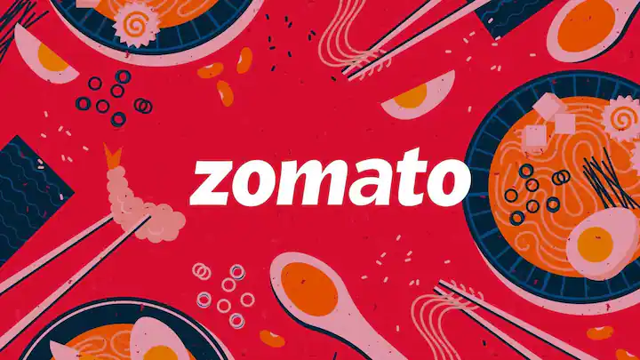
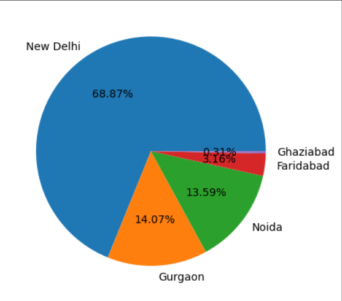
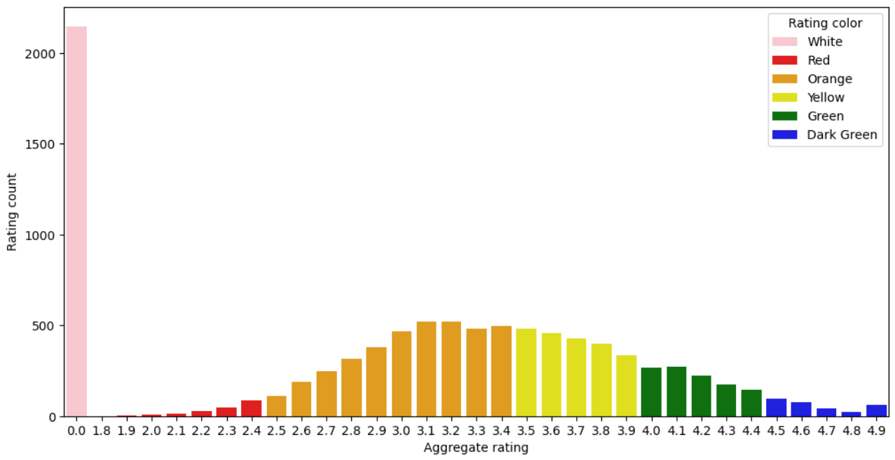
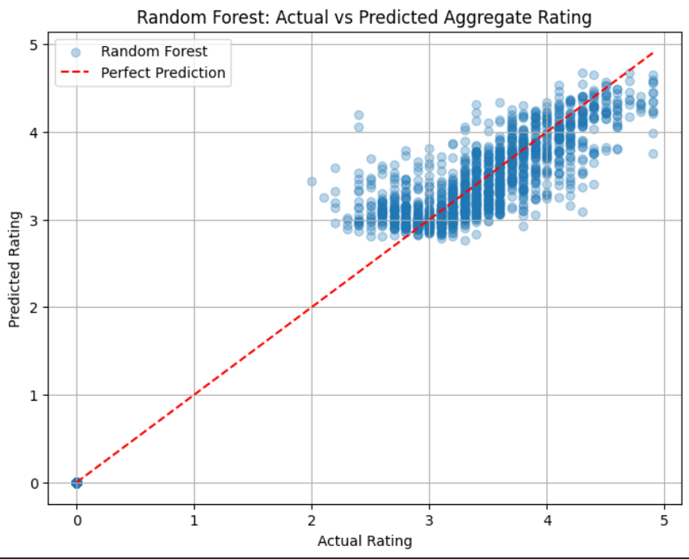
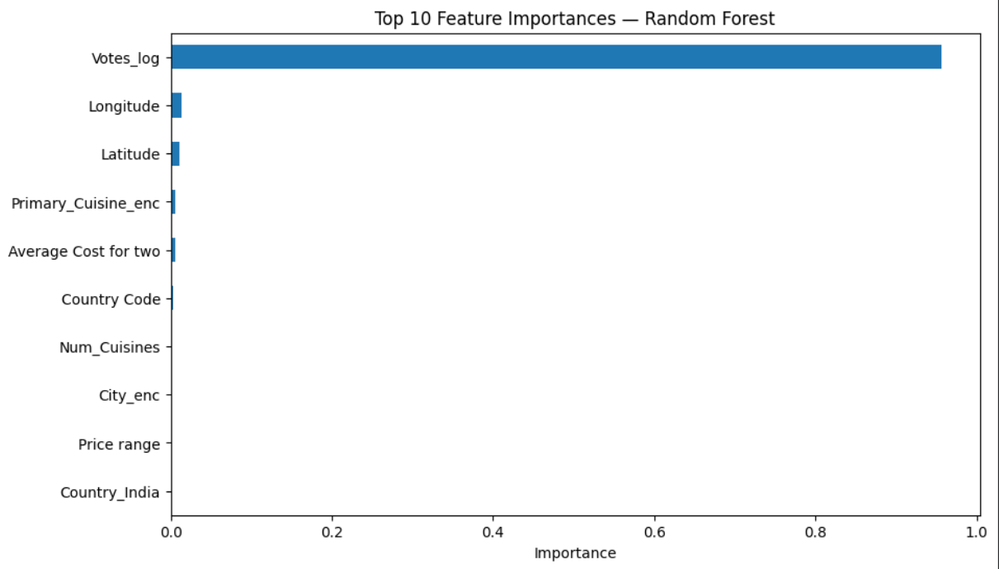

# 🍽️ Zomato Restaurant Rating Analysis & Prediction

> Exploring what makes a restaurant highly rated — and predicting `Aggregate rating` using Machine Learning.


---



---

## 📖 Overview

This project analyzes the **Zomato restaurant dataset**, covering restaurants across multiple countries, cities, and cuisines. The goal is two-fold:

1. 📊 **Explore** patterns in ratings, cuisines, delivery options, and geography
2. 🤖 **Predict** a restaurant's `Aggregate rating` using demographic, pricing, and service features

---

## 🗂️ Dataset Snapshot

| Attribute | Detail |
|---|---|
| Records | 9,551 restaurants |
| Countries | 15 (India, USA, UK, Brazil, UAE, and more) |
| Key Features | City, Cuisines, Price Range, Votes, Table Booking, Online Delivery |
| Target Variable | `Aggregate rating` (0.0 – 4.9 scale) |

---

## 🔍 Exploratory Findings

### 🌍 India Dominates the Dataset



Out of 9,551 restaurants, **8,652 are based in India** — meaning any model or insight here is heavily India-centric, with limited signal from other countries.

### 🏙️ Delhi-NCR Leads City-Wise
```
New Delhi   ████████████████████████████████████████████  68.87%
Gurgaon     █████████                                       14.07%
Noida       █████████                                       13.59%
Faridabad   ██                                                3.16%
Ghaziabad   ▌                                                 0.29%
```
Restaurants are heavily concentrated in the **Delhi-NCR region**.

### ⭐ Rating Distribution



| Rating Band | Color | Meaning | Count |
|---|---|---|---:|
| 0.0 | ⚪ White | Not Rated | 2,148 |
| 1.8 – 2.4 | 🔴 Red | Poor | 179 |
| 2.5 – 3.4 | 🟠 Orange | Average | 2,738 |
| 3.5 – 3.9 | 🟡 Yellow | Good | 2,100 |
| 4.0 – 4.4 | 🟢 Green | Very Good | 1,079 |
| 4.5 – 4.9 | 🟩 Dark Green | Excellent | 301 |

> 💡 **Finding:** Nearly **22% of restaurants have no rating at all**, and most rated restaurants fall in the "Average" to "Good" range — truly "Excellent" restaurants are rare (~3%).

### 🚫 "Not Rated" Restaurants Are Overwhelmingly Indian
```
India             2,139
Brazil                5
United States         3
United Kingdom        1
```
Of all "Not Rated" restaurants, **99.4% are in India** — suggesting a data collection or platform-maturity gap in the Indian market specifically.

### 📦 Online Delivery — India Leads Adoption
```
India:  No → 6,229   |   Yes → 2,423   (~28% offer online delivery)
```
All other countries in the dataset show **zero online delivery adoption**, making India the only market where this feature has any variance.

---

## 🤖 Predictive Modeling — Can We Predict a Restaurant's Rating?

### 🔧 Feature Engineering
- Cleaned binary fields (`Has Table booking`, `Has Online delivery`, etc.) → 0/1
- Extracted `Num_Cuisines` and `Primary_Cuisine` from the multi-label `Cuisines` field
- Bucketed rare countries into `"Other"` to avoid one-hot sparsity
- Log-transformed `Votes` to handle heavy right-skew
- Encoded `City` and `Primary_Cuisine` via label encoding

### 🏆 Model Comparison

| Model | MAE ⬇️ | RMSE ⬇️ | R² ⬆️ |
|---|:---:|:---:|:---:|
| Linear Regression | 0.665 | 0.788 | 0.727 |
| Random Forest 🌲 | **0.194** | 0.295 | **0.962** |
| **Gradient Boosting 🚀** | 0.197 | **0.294** | **0.962** |

> 🥇 **Random Forest and Gradient Boosting are essentially tied for best performance**, both dramatically outperforming Linear Regression.

### 📌 Best Model Snapshot

| Metric | Value |
|:---:|:---:|
| **MAE** | 0.19 – 0.20 rating points |
| **RMSE** | ~0.29 |
| **R²** | **0.962** |

> On a rating scale of 0–5, predictions are typically within **~0.2 points** of the true rating — a very strong result.

### 📈 Actual vs Predicted (Random Forest)



Points cluster tightly along the diagonal — confirming the high R² visually.

### 🔎 Why Linear Regression Falls Behind
Linear Regression assumes a straight-line relationship between features and rating. Real-world rating behavior is **non-linear and interaction-heavy** (e.g., "high votes + online delivery + mid-range price" combos behave differently together than each feature would predict alone) — exactly what tree-based ensembles are built to capture.

### 🔝 Top 10 Feature Importances (Random Forest)



---

## 🌟 Key Takeaways

- 🇮🇳 **India dominance skews everything** — with 94% of records from India, findings mostly describe the Indian food-delivery market, not a global pattern.
- 🎯 **Tree-based models crush linear models here** — R² jumped from **0.73 → 0.96** simply by switching from Linear Regression to Random Forest/Gradient Boosting.
- 🗳️ **Votes matter a lot** — restaurant popularity (captured via log-transformed vote count) is a strong signal for rating prediction, alongside price range and cuisine diversity.
- 📭 **"Not Rated" isn't random** — it's concentrated almost entirely in India, hinting at newer or less-established listings on the platform.
- 🍱 **Cuisine diversity adds signal** — restaurants serving more cuisines (`Num_Cuisines`) show measurable influence on predicted ratings.

---

## 🚀 Future Improvements

- [ ] Try **XGBoost / LightGBM** for potentially faster and even more accurate boosting
- [ ] Hyperparameter tuning via `GridSearchCV` for Random Forest & Gradient Boosting
- [ ] Build a **classification model** for `Rating text` (Poor/Average/Good/Excellent) instead of raw regression
- [ ] One-hot encode full `Cuisines` list (multi-label) instead of just the primary cuisine
- [ ] Add **geospatial visualization** using `Latitude`/`Longitude` (e.g., Folium heatmap of rating hotspots)
- [ ] Investigate the India-only "Not Rated" pattern further — possible data quality or business insight

---

## 🛠️ Tech Stack

`Python` · `Pandas` · `NumPy` · `Matplotlib` · `Seaborn` · `scikit-learn`

---

## 📂 Project Structure

```
├── zomato.csv                          # Restaurant dataset
├── Country-Code.xlsx                   # Country code lookup table
├── zomato.ipynb                        # Full EDA + modeling notebook
├── README.md                           # You are here 👋
└── images/
    ├── cover.png                       # Project cover image
    ├── aggregate_rating.png            # Rating distribution chart
    ├── pie_chart.png                   # Country distribution pie chart
    ├── random_forest_actual_vs_predicted.png   # Actual vs predicted scatter plot
    └── top_10_important_features.png   # Feature importance bar chart
```

---

### ⭐ If you found this project useful, consider giving it a star!
